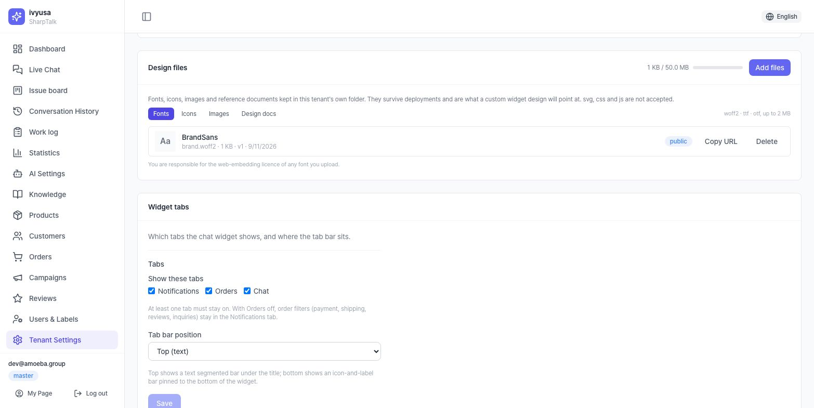
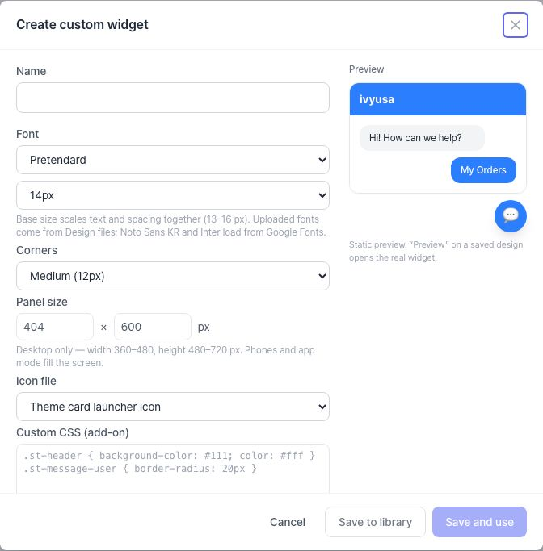
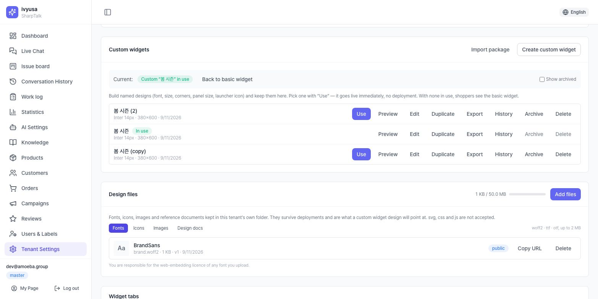
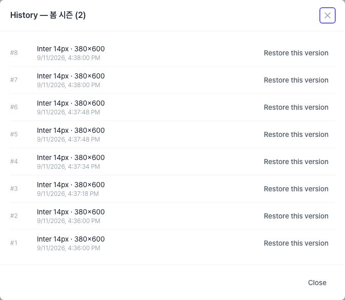
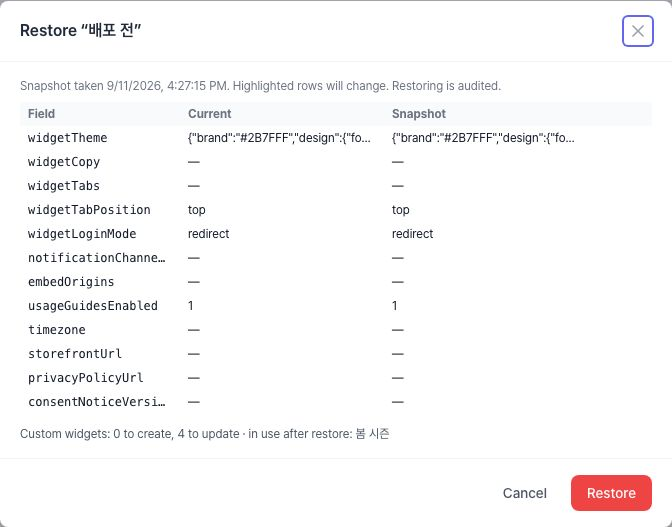
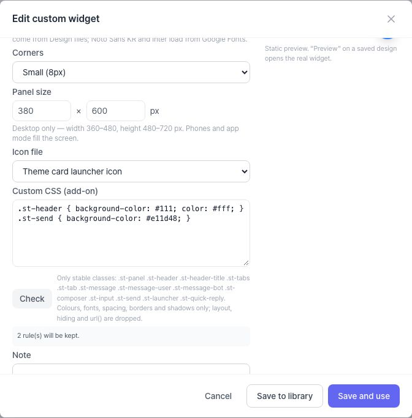
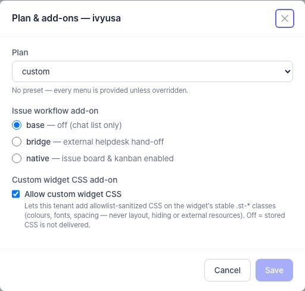

# Sổ tay tạo widget tùy chỉnh SharpTalk — thiết kế widget theo từng tenant

> Phiên bản 1.0 · Bản đầu 2026-09-13 · Biên soạn dựa trên mã nguồn
> Đối tượng: người vận hành tenant (master/director — tệp thiết kế, widget tùy chỉnh và ảnh chụp cài đặt chỉ dành cho hai cấp này) · Chương 6 dành cho quản trị viên nền tảng
> Bản trực tuyến: https://shoptalk.amoeba.site/manual (bản HTML, bản gốc tiếng Hàn và bản dịch tiếng Anh)
> Đọc trước: [Sổ tay cài đặt nhanh](quick-setup.vi.md) chương 5 (cài widget · chủ đề)

Mỗi chương theo thứ tự **thuật ngữ → các bước → 💡 mẹo**. Mọi màn hình đều nằm ở tab **Cài đặt gian hàng > Cài đặt widget** (riêng chương 6: bảng quản trị nền tảng).

---

## Mục lục
0. [Widget cơ bản và widget tùy chỉnh](#0-widget-cơ-bản-và-widget-tùy-chỉnh)
1. [Chuẩn bị — tệp thiết kế](#1-chuẩn-bị--tệp-thiết-kế)
2. [Tạo — trình soạn widget tùy chỉnh](#2-tạo--trình-soạn-widget-tùy-chỉnh)
3. [Kiểm tra & áp dụng — Xem trước → Dùng](#3-kiểm-tra--áp-dụng--xem-trước--dùng)
4. [Vận hành — hoàn tác & chuyển giao](#4-vận-hành--hoàn-tác--chuyển-giao)
5. [Mở rộng — CSS đã lọc (tiện ích)](#5-mở-rộng--css-đã-lọc-tiện-ích)
6. [Quản trị nền tảng — tiện ích & dung lượng](#6-quản-trị-nền-tảng--tiện-ích--dung-lượng)
7. [Danh sách kiểm tra vận hành](#7-danh-sách-kiểm-tra-vận-hành)
8. [FAQ / xử lý sự cố](#8-faq--xử-lý-sự-cố)

---

## 0. Widget cơ bản và widget tùy chỉnh

Diện mạo của widget chat trên cửa hàng được quyết định bởi **hai lớp**.

```
Thẻ Chủ đề widget (widget cơ bản)             ── luôn áp dụng
  màu thương hiệu · kiểu header · logo · vị trí/kích thước/biểu tượng nút mở
        │
        ▼  widget tùy chỉnh đang [Dùng] sẽ phủ lên trên
Widget tùy chỉnh (thư viện thiết kế)          ── chỉ áp dụng khi đang dùng
  phông · cỡ chữ · bo góc · kích thước bảng · tệp biểu tượng · (tiện ích) CSS đã lọc
```

| Thuật ngữ | Ý nghĩa |
|---|---|
| Widget cơ bản | Widget vẽ từ thẻ Chủ đề widget mà thôi. Khi không có widget tùy chỉnh nào đang dùng, khách hàng thấy widget này |
| Widget tùy chỉnh | Một **bộ thiết kế** có tên được lưu lại (phông, cỡ chữ, bo góc, bảng, biểu tượng, CSS). Có thể giữ nhiều bộ và chỉ bật đúng một bộ bằng [Dùng] |
| Thư viện | Danh sách trong thẻ Widget tùy chỉnh, gồm trạng thái Đang dùng / Đã lưu trữ và các nút thao tác (Xem trước · Sửa · Nhân bản · Xuất · Lịch sử · Lưu trữ · Xóa) |
| Tệp thiết kế | Phông, biểu tượng, hình ảnh và tài liệu thiết kế mà widget tùy chỉnh tham chiếu. Lưu trong thư mục riêng của tenant, không bị ảnh hưởng khi triển khai |
| Dùng | Nút áp dụng một thiết kế trong thư viện cho widget của khách. Có hiệu lực **ngay lập tức, không cần triển khai** |

**Khi nào cần widget tùy chỉnh**
- Muốn dùng phông thương hiệu trong widget (thẻ chủ đề chỉ đổi màu)
- Chuẩn bị sẵn diện mạo khác cho từng mùa hay chiến dịch rồi đổi đúng ngày
- Muốn bảng trên máy tính lớn hơn/nhỏ hơn, góc bo tròn hơn
- Muốn dùng hình riêng cho nút mở widget

Nếu chỉ cần đổi màu, logo và vị trí nút mở thì **thẻ Chủ đề widget** là đủ.

💡 **Mẹo**: Widget tùy chỉnh **phủ lên** thẻ chủ đề chứ không thay thế. Muốn đổi màu thương hiệu, hãy sửa thẻ chủ đề chứ không phải widget tùy chỉnh — thiết kế đang dùng sẽ nhận ngay thay đổi đó.

---

## 1. Chuẩn bị — tệp thiết kế

Để dùng **phông tải lên** hoặc **tệp biểu tượng** trong widget tùy chỉnh, hãy tải lên thẻ Tệp thiết kế trước. Nếu chỉ dùng phông có sẵn và biểu tượng nút mở của thẻ chủ đề, có thể bỏ qua chương này.



### 1.1 Quy cách theo loại

| Loại | Định dạng | Giới hạn | Hiển thị | Dùng cho |
|---|---|---|---|---|
| Phông | woff2 · ttf · otf | 2MB | công khai (widget tải trực tiếp) | mục "Phông tải lên" trong trình soạn |
| Biểu tượng | png · webp | 256KB · 512×512px | công khai | mục "Tệp biểu tượng" trong trình soạn (nút mở) |
| Hình ảnh | png · jpg · webp | 2MB · 2000px | công khai | chia sẻ bản thiết kế, Sao chép URL (widget không tự dùng) |
| Tài liệu thiết kế | pdf · png · jpg | 10MB | riêng tư (URL có chữ ký) | lưu bản phác thảo, cẩm nang thương hiệu |

- Toàn bộ khu vực thiết kế giới hạn **50MB** (thanh dung lượng ở góc trên phải thẻ). Khi đầy, việc thêm tệp bị từ chối (E5084).
- **Không nhận svg, css, js.** Tệp được kiểm tra theo nội dung nên đổi phần mở rộng cũng không qua được (E5081).
- Biểu tượng và hình ảnh được mã hóa lại trên máy chủ. Vượt giới hạn pixel sẽ bị từ chối (E5083).

### 1.2 Các bước tải lên

1. Cài đặt > Cài đặt widget > thẻ **Tệp thiết kế**: chọn tab loại (Phông / Biểu tượng / Hình ảnh / Tài liệu thiết kế).
2. **[Thêm tệp]** → chọn tệp. Danh sách hiển thị tên tệp làm nhãn.
3. Có dòng mới là xong. Muốn thay tệp: tải tệp mới, chọn nó trong trình soạn rồi xóa tệp cũ (tải cùng tên sẽ tạo dòng mới chứ không ghi đè).
4. Tệp công khai có **[Sao chép URL]** (để dùng cùng phông ở nơi khác trên trang). Tài liệu thiết kế chỉ có [Tải về].

⚠️ **Bản quyền phông**: việc phân phối phông đã tải lên tới trình duyệt khách hàng là trách nhiệm của tenant. Chỉ tải lên phông được phép nhúng web.

💡 **Mẹo**: **woff2** nhỏ và nhanh nhất. ttf/otf cũng được nhưng dễ chạm trần 2MB và làm chậm lần tải đầu. Với phông CJK, nên dùng woff2 đã cắt gọn (subset).

---

## 2. Tạo — trình soạn widget tùy chỉnh



Cài đặt > Cài đặt widget > thẻ **Widget tùy chỉnh** → **[Tạo widget tùy chỉnh]**.

### 2.1 Các trường

| Trường | Giá trị | Ghi chú |
|---|---|---|
| Tên | tối đa 64 ký tự, duy nhất trong tenant | Hiển thị trong thư viện. Tên trùng bị từ chối (E5087) |
| Phông | Pretendard (mặc định) · Noto Sans KR · Inter · Phông hệ thống · Phông tải lên | Noto Sans KR và Inter tải từ Google Fonts. Chọn "Phông tải lên" sẽ hiện ô chọn **Tệp phông** (chương 1) |
| Cỡ cơ bản | 13–16px (mặc định 14) | Phóng to/thu nhỏ chữ **và khoảng cách cùng lúc**, như zoom toàn bộ widget |
| Bo góc | Nhỏ 8px · Vừa 12px · Lớn 16px | Bo góc bảng; bong bóng và nút theo tỉ lệ |
| Kích thước bảng | rộng 360–480 · cao 480–720 (mặc định 404×600) | **Chỉ máy tính.** Di động và chế độ ứng dụng lấp đầy màn hình |
| Tệp biểu tượng | biểu tượng nút mở của thẻ chủ đề (mặc định) · biểu tượng tải lên | Hình trên nút mở tròn. Biểu tượng tải lên sẽ thay cho lựa chọn ở thẻ chủ đề |
| CSS tùy chỉnh (tiện ích) | CSS đã lọc | Chỉ hiện với tenant được quản trị viên nền tảng bật tiện ích (chương 5) |
| Ghi chú | văn bản tự do | Ghi chú vận hành như "Xuân 2026, phụ trách ○○". Khách hàng không thấy |

**Xem trước nhanh** bên phải chỉ mô phỏng phông, cỡ chữ và bo góc. Hãy kiểm tra widget thật bằng **[Xem trước]** sau khi lưu (chương 3).

### 2.2 Hai cách lưu

| Nút | Kết quả |
|---|---|
| **[Lưu vào thư viện]** | Chỉ lưu thiết kế. Widget của khách không đổi. Dùng khi muốn xem trước trước |
| **[Lưu và dùng]** | Lưu và áp dụng ngay cho khách. Thiết kế đang dùng trước đó tự động tắt |

💡 **Mẹo**: Với thiết kế đầu tiên, nên đi theo **[Lưu vào thư viện] → [Xem trước] → [Dùng]**. Xem trước nhanh trong trình soạn không phản ánh màu thương hiệu, logo hay bố cục tab, nên chỉ widget thật mới cho thấy tổng thể.

💡 **Mẹo**: Tăng cỡ cơ bản lên 16px sẽ làm bảng có vẻ chật. Hãy mở rộng bảng cùng lúc (ví dụ 15px + 440×640).

---

## 3. Kiểm tra & áp dụng — Xem trước → Dùng



### 3.1 Xem trước widget thật

**[Xem trước]** trên một dòng mở **widget thật** với thiết kế đó trên trang cửa hàng mẫu.

- Tải bằng **mã xem trước 10 phút**. Khách hàng không bị ảnh hưởng; hết hạn thì bấm [Xem trước] lại.
- Xem trước cần **tên miền cửa hàng** (Cài đặt > Cài đặt cơ bản > Storefront). Chưa có thì hiện thông báo thay thế.
- Gửi tin nhắn trong xem trước sẽ tạo phiên demo thật — chỉ nên dùng để kiểm tra nội dung.


### 3.2 Dùng · Về widget cơ bản

| Thao tác | Kết quả |
|---|---|
| **[Dùng]** trên dòng | Thiết kế đó có hiệu lực. Dòng "Hiện tại:" ở đầu thẻ ghi **Tùy chỉnh "tên" đang dùng** và dòng có huy hiệu **Đang dùng** |
| **[Về widget cơ bản]** | Tắt thiết kế tùy chỉnh. Khách thấy widget cơ bản vẽ từ thẻ chủ đề. Thiết kế vẫn nằm trong thư viện |

Áp dụng **ngay lập tức, không cần triển khai**. Máy chủ ghi lại "tệp trực tiếp" của tenant và widget của khách đọc tệp đó ở lần tải kế tiếp.

- Khách mở trang mới: thấy thiết kế mới ngay
- Khách đang mở widget: thấy thiết kế mới sau khi tải lại trang
- Widget vẽ chủ đề trong bộ nhớ đệm trước rồi mới cập nhật từ tệp trực tiếp, nên diện mạo cũ có thể lóe lên rất ngắn

### 3.3 Sửa thiết kế đang dùng

[Sửa] thiết kế có huy hiệu **Đang dùng** sẽ cảnh báo khi lưu: *"Thiết kế này đang dùng — lưu sẽ áp dụng ngay cho khách."*

⚠️ **Khuyến nghị**: không sửa trực tiếp thiết kế đang dùng. Hãy **[Nhân bản] → sửa bản sao → [Xem trước] → [Dùng]**. Nếu có sai sót, thiết kế cũ vẫn còn trong thư viện và chỉ cần một cú bấm để quay lại. Nếu buộc phải vá tại chỗ, hãy làm, và dùng **[Lịch sử]** để khôi phục phiên bản trước nếu cần (§4.1).

---

## 4. Vận hành — hoàn tác & chuyển giao

Có ba cách "hoàn tác" thiết kế, mỗi cách một phạm vi.

| Công cụ | Phạm vi | Đơn vị hoàn tác | Chuyển sang tenant/môi trường khác |
|---|---|---|---|
| **Lịch sử** (4.1) | một thiết kế | một lần lưu (phiên bản) | không |
| **Gói** (4.3) | một thiết kế + phông/biểu tượng đính kèm | một tệp | **có** (xuất JSON → nhập) |
| **Ảnh chụp cài đặt** (4.4) | 12 trường cài đặt (chủ đề, nội dung, tab…) + toàn bộ thư viện widget tùy chỉnh | một ảnh chụp | chỉ tải về; khôi phục trong cùng tenant |

### 4.1 Lịch sử



- Mỗi lần lưu giữ lại **trạng thái ngay trước khi lưu** thành một phiên bản (#1, #2 …). Lưu chỉ đổi tên hoặc ghi chú không tạo phiên bản.
- **[Lịch sử]** trên dòng → **[Khôi phục phiên bản này]**. Khôi phục cũng ghi trạng thái hiện tại thành phiên bản, nên có thể hoàn tác cả việc khôi phục.
- Khôi phục thiết kế đang dùng sẽ áp dụng ngay cho khách (cảnh báo như §3.3).
- Danh sách hiển thị 50 phiên bản mới nhất. Xóa thiết kế sẽ xóa cả lịch sử.

### 4.2 Nhân bản · Lưu trữ · Xóa

| Thao tác | Quy tắc |
|---|---|
| Nhân bản | Tạo bản sao tên "(copy)", "(copy 2)". Điểm khởi đầu cho các biến thể theo mùa |
| Lưu trữ | Ẩn khỏi danh sách. **Thiết kế đang dùng không thể lưu trữ** (E5086) — hãy [Dùng] thiết kế khác hoặc [Về widget cơ bản] trước. Bật **Hiện đã lưu trữ** ở góc trên phải thẻ để thấy và [Khôi phục] |
| Xóa | Không thể hoàn tác. Bị từ chối khi đang dùng (E5086). Lịch sử cũng bị xóa |

### 4.3 Xuất · nhập gói

- **[Xuất]** trên dòng tải về tệp JSON `sharptalk-widget-design`. **Phông và biểu tượng tải lên mà thiết kế tham chiếu được đính kèm**, nên một tệp là đủ.
- **[Nhập gói]** ở góc trên phải thẻ → chọn tệp JSON (tối đa 12MB). Phông và biểu tượng đính kèm được kiểm tra nội dung như khi tải lên và đăng ký lại vào tệp thiết kế; tên trùng được thêm "(2)". Thiết kế nhập vào **chỉ nằm trong thư viện** — hãy tự bấm [Dùng].
- Dùng khi: chuyển thiết kế sang tenant khác (người vận hành nhiều thương hiệu) hay môi trường khác, trao đổi tệp với nhà thiết kế bên ngoài.

### 4.4 Ảnh chụp cài đặt (Cài đặt > Cài đặt khác)



- Cài đặt > **Cài đặt khác** > thẻ **Ảnh chụp cài đặt** → nhập nhãn (ví dụ "trước khi triển khai") → **[Lưu ảnh chụp]**.
- Nội dung lưu: chủ đề widget, nội dung, tab, vị trí tab, cách đăng nhập, kênh thông báo, origin nhúng, tùy chọn tri thức, múi giờ, storefront, thông báo quyền riêng tư + **toàn bộ thư viện widget tùy chỉnh** (tên, trạng thái, thiết kế, bộ đang dùng). Thông tin xác thực tích hợp và bí mật nhúng **không bao giờ được lưu**.
- **[Khôi phục…]** hiển thị giá trị hiện tại và giá trị trong ảnh chụp cạnh nhau, tô đậm các dòng sẽ đổi. Dòng cuối "Widget tùy chỉnh: tạo n · cập nhật n · đang dùng sau khôi phục: tên" cho biết trước điều xảy ra với thư viện. [Khôi phục] được ghi vào nhật ký kiểm tra.
- Chụp một ảnh trước mọi thay đổi lớn (đổi mùa, sửa hàng loạt nội dung) là bảo hiểm rẻ nhất.

💡 **Mẹo**: Lịch sử = "thiết kế này, lúc vừa nãy"; gói = "thiết kế này, ở nơi khác"; ảnh chụp = "toàn bộ cài đặt widget, về lúc đó". Xác định cần cái nào trước thì sẽ không lạc.

---

## 5. Mở rộng — CSS đã lọc (tiện ích)

Ô **CSS tùy chỉnh (tiện ích)** ở cuối trình soạn **chỉ xuất hiện khi quản trị viên nền tảng đã bật "Cho phép CSS widget tùy chỉnh" cho tenant này** (chương 6). Không thấy ô này, hãy đề nghị quản trị viên bật tiện ích.



### 5.1 Có thể đổi gì

Widget cung cấp 13 **lớp ổn định** — các điểm móc có tên không bao giờ đổi. Trên đó chỉ được đặt **màu, phông, khoảng cách, viền và bóng**.

| Lớp | Điểm móc |
|---|---|
| `.st-panel` | toàn bộ bảng |
| `.st-header` / `.st-header-title` | header / chữ tiêu đề header |
| `.st-tabs` / `.st-tab` | thanh tab / một tab |
| `.st-message` / `.st-message-user` / `.st-message-bot` | mọi bong bóng / khách / AI hoặc nhân viên |
| `.st-composer` / `.st-input` / `.st-send` | vùng soạn / ô nhập / nút gửi |
| `.st-launcher` | nút mở widget |
| `.st-quick-reply` | nút trả lời nhanh (kịch bản) |

**Được phép**
- Bộ chọn: các lớp `.st-*` và tổ hợp của chúng (`.st-panel .st-tab`, `.st-a > .st-b`), có thể kết thúc bằng `:hover` `:focus` `:active` `:first-child` `:last-child` `:disabled`
- Thuộc tính: `color` `background(-color)` `border*` `border-radius*` `font-family/size/weight/style` `line-height` `letter-spacing` `text-*` `padding*` `margin*` `gap` `box-shadow` `outline*` `width/height` (kể cả min/max)
- Giá trị: giá trị màu, `rgb()/rgba()/hsl()/hsla()`, biến widget `var(--ivy-…)`, số, đơn vị, từ khóa
- Giới hạn 32KB

**Bị loại (tự động lọc khi lưu, có nêu lý do)**
- Vị trí, ẩn, xếp lớp: `display` `visibility` `opacity` `position` `transform` `z-index` `content`
- Tài nguyên ngoài: `url()` `@import` `@font-face` `@media` và mọi quy tắc `@` khác
- Bộ chọn ngoài `.st-` (`body`, `#id`, bộ chọn thuộc tính), khối lồng nhau, quy tắc trong chú thích

### 5.2 Các bước và [Kiểm tra]

1. Nhập quy tắc vào ô **CSS tùy chỉnh (tiện ích)** trong trình soạn.
2. **[Kiểm tra]** → "n quy tắc sẽ được giữ" kèm **lý do của từng mục bị loại**. Chỉnh cho đến khi không còn báo gì.
3. Khi lưu chỉ **các quy tắc đã qua kiểm tra** được lưu (bản đã lọc, không phải bản gốc).
4. Kiểm tra trên widget thật bằng [Xem trước] → [Dùng].

Ví dụ
```
.st-header { background-color: #111; color: #fff; }
.st-header-title { letter-spacing: 0.02em; }
.st-send { background-color: var(--ivy-primary-700); border-radius: 999px; }
.st-message-bot { border: 1px solid #e5e7eb; box-shadow: 0 1px 2px rgba(0,0,0,.06); }
```

⚠️ Màu chữ tiêu đề header không đổi qua `.st-header { color }` (tiêu đề có màu riêng). Hãy đặt trên **`.st-header-title`**.

💡 **Mẹo**: Cặp màu tương phản thấp (chữ nhạt trên nền nhạt) không bị kiểm tra bắt. Khác với màu thương hiệu ở thẻ chủ đề, CSS không được tự hiệu chỉnh theo tỉ lệ tương phản 4.5:1 — hãy tự kiểm tra.

---

## 6. Quản trị nền tảng — tiện ích & dung lượng



- Bảng quản trị > Gian hàng > **[Gói/Add-on]** trên dòng → tích **Cho phép CSS widget tùy chỉnh** → [Lưu]. Thay đổi được ghi nhật ký.
- Khi tắt: ô CSS biến mất khỏi trình soạn của tenant và **CSS đã lưu không còn được gửi tới khách** (phần còn lại của thiết kế — phông, cỡ chữ… — vẫn giữ). Bật lại thì CSS đã lưu sống lại nguyên vẹn.
- Cột **Tệp** trong danh sách tenant là dung lượng thư mục của tenant (tệp thiết kế và ảnh chụp cài đặt). Dùng để tìm tenant sắp chạm trần 50MB.

---

## 7. Danh sách kiểm tra vận hành

**Đổi thiết kế theo mùa (thứ tự khuyến nghị)**
- [ ] Cài đặt > Cài đặt khác: **lưu ảnh chụp** ("trước mùa ○○")
- [ ] Tải phông và biểu tượng cần dùng lên **Tệp thiết kế** (quy cách §1.1)
- [ ] **[Nhân bản]** thiết kế đang dùng → sửa bản sao → **[Lưu vào thư viện]**
- [ ] **[Xem trước]** trên máy tính; kiểm tra thêm trang thật trên di động
- [ ] **[Dùng]** → tải lại cửa hàng và xác nhận
- [ ] Hết mùa: **[Dùng]** thiết kế trước hoặc **[Về widget cơ bản]**, rồi **[Lưu trữ]** thiết kế đã xong

**Chọn cách hoàn tác**
- Vừa lưu xong thấy sai → **[Lịch sử]** → khôi phục phiên bản trước
- Cùng thiết kế cho tenant/môi trường khác → **[Xuất]** → **[Nhập gói]**
- Nội dung, tab, chủ đề đều về như cũ → Cài đặt > Cài đặt khác **[Khôi phục…]**

---

## 8. FAQ / xử lý sự cố

**Q. Đã bấm [Dùng] nhưng widget trên trang vẫn như cũ.**
Tải lại trang. Widget vẽ chủ đề trong bộ nhớ đệm trước rồi mới cập nhật từ tệp trực tiếp. Nếu vẫn vậy, kiểm tra dòng "Hiện tại:" ở đầu thư viện có đúng thiết kế đó không, và tên miền cài widget có trùng tên miền cửa hàng trong Cài đặt > Cài đặt cơ bản không.

**Q. Phông tải lên không hiện trong widget.**
Trong trình soạn, đảm bảo Phông là "Phông tải lên" và tệp đã được chọn ở **Tệp phông**. Nếu tệp được tải lên dạng "riêng tư" (Tài liệu thiết kế), widget không lấy được — hãy tải lại ở loại **Phông**.

**Q. [Xem trước] báo "Hãy đặt tên miền cửa hàng trước".**
Lưu tên miền cửa hàng ở Cài đặt > Cài đặt cơ bản > Storefront rồi thử lại. Xem trước mô phỏng phiên widget của tên miền đó.

**Q. Trình soạn không có ô CSS tùy chỉnh.**
Ô này chỉ hiện sau khi quản trị viên nền tảng bật "Cho phép CSS widget tùy chỉnh" cho tenant (chương 6). Thiết kế lưu trước đó không có CSS, hãy sửa sau khi bật.

**Q. Thêm tệp bị từ chối với "Tệp không đúng loại".**
Hệ thống kiểm tra **nội dung**, không phải phần mở rộng. svg đổi tên thành png, hay ttf lưu thành .woff2 đều bị bắt. Hãy chuyển sang đúng định dạng rồi tải lại.

**Q. Kích thước bảng không đổi trên di động.**
Đúng như thiết kế. Chiều rộng và cao của bảng chỉ áp dụng **trên máy tính**; di động và chế độ ứng dụng lấp đầy màn hình. Phông, bo góc và biểu tượng vẫn áp dụng trên di động.

**Q. Lưu trữ bị từ chối với "Thiết kế này đang dùng".**
[Dùng] thiết kế khác hoặc [Về widget cơ bản] trước, rồi mới lưu trữ. Thiết kế đang dùng không thể lưu trữ hay xóa.

**Q. Lịch sử không có lần đổi tên vừa rồi.**
Lịch sử chỉ ghi các lần lưu làm đổi **thiết kế** (phông, cỡ chữ, bo góc, bảng, biểu tượng, CSS). Đổi tên và ghi chú không tạo phiên bản và không được khôi phục.
